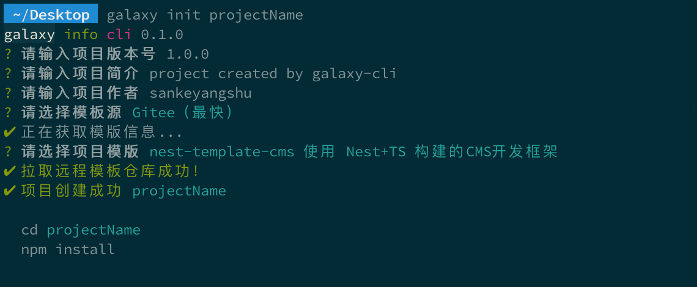

<h1 align="center">
  
  <br>
  Galaxy-CLI-Core
</h1>
<h4 align="center">一个用于快速生成各种前后端项目模版的脚手架 | Galaxy-CLI的核心包</h4>

<p align="center">
  
  
</p>

---

## 安装和使用

### 使用

- 安装依赖

```bash
npm i -g galaxy-cli-core

# yarn
yarn global add galaxy-cli-core

# 推荐使用pnpm进行安装
pnpm i -g galaxy-cli-core
```

- 创建项目



### 本地调试

- 获取代码

```bash
git clone https://github.com/sankeyangshu/galaxy-cli.git
```

- 安装依赖

```bash
cd galaxy-cli

# 推荐使用pnpm管理依赖，如果需要使用其他包管理工具，需要将package.json中`preinstall`删除
pnpm install
```

- 运行

```bash
cd packages/core

pnpm run dev
```

- 打包

```bash
cd packages/core

pnpm run build
```

## 简介

**galaxy-cli-core** 是 **Galaxy-CLI** 的核心包，提供了用于快速生成各种前后端项目模版的功能

## 如何贡献

你可以[提一个 issue](https://github.com/sankeyangshu/galaxy-cli/issues) 或者提交一个 Pull Request。

**Pull Request:**

1. Fork 代码
2. 创建自己的分支: `git checkout -b feat/xxxx`
3. 提交你的修改: `git commit -am 'feat(function): add xxxxx'`
4. 推送您的分支: `git push origin feat/xxxx`
5. 提交 `pull request`

## Git 贡献提交规范

- `feat`: 新增功能
- `fix`: 修复 bug
- `docs`: 文档变更
- `style`: 代码格式（不影响功能，例如空格、分号等格式修正）
- `refactor`: 代码重构（不包括 bug 修复、功能新增）
- `perf`: 性能优化
- `test`: 添加、修改测试用例
- `build`: 构建流程、外部依赖变更（如升级 npm 包、修改 webpack 配置等）
- `ci`: 修改 CI 配置、脚本
- `chore`: 对构建过程或辅助工具和库的更改（不影响源文件、测试用例）
- `revert`: 回滚 commit

## 许可证

[MIT License](https://github.com/sankeyangshu/galaxy-cli/blob/master/LICENSE)
